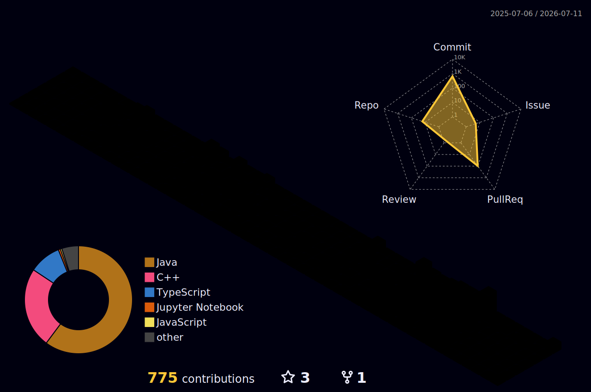

  <!-- Header Banner -->
  

  <!-- Social badges -->
  

    <a href="https://github.com/DamPhuQuy">
      
      <strong> GitHub</strong>
    </a>
    &nbsp;&nbsp;&nbsp;
    <a href="mailto:phuquydam06@gmail.com">
    
    <strong> Email</strong>
  </a>

  <!-- Typing Animation -->
  

    
  

  <!-- Slogan -->
  

    <strong>Building backend applications with Java, Spring Boot, PostgreSQL, and a strong focus on clean design and practical reliability.</strong>
  

  

### About Me

- Student at **The University of Danang - University of Science and Technology**
- Backend-focused developer working mainly with **Java, Spring Boot, PostgreSQL, and Docker**
- Interested in **API design, database modeling, authentication/authorization, and maintainable backend architecture**

<h3>Technology Stack</h3>

<table align="center" width="100%">
<tr>
<td align="center" valign="top" width="50%">
<h4>Backend Development</h4>

&nbsp;

&nbsp;

 
Java · Spring Boot · Go
</td>
<td align="center" valign="top" width="50%">
<h4>Data &amp; Storage</h4>

&nbsp;

 
PostgreSQL · MySQL · Redis
</td>
</tr>
<tr>
<td align="center" valign="top" width="50%">
<h4>AI &amp; Machine Learning</h4>

&nbsp;

 
Python · PyTorch · RAG · Vector Databases
</td>
<td align="center" valign="top" width="50%">
<h4>Development Workflow</h4>

&nbsp;

&nbsp;

 
Git · GitHub · Postman
</td>
</tr>
<tr>
<td align="center" valign="top" width="50%">
<h4>Build &amp; Delivery</h4>

&nbsp;

&nbsp;

 
Maven · Gradle · Docker
</td>
<td align="center" valign="top" width="50%">
<h4>Frontend Web Development</h4>

 
TypeScript
</td>
</tr>
</table>

### GitHub Activity

  

  

  

  <!-- Main contribution calendar -->
  

  

  <!-- Detailed activity timeline -->
  

